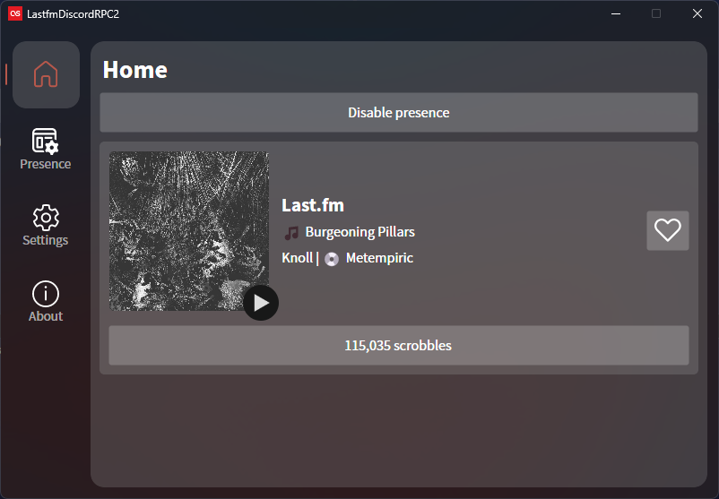

<h3>A simple cross-platform application that allows you to set a rich presence on your Discord account from your Last.fm profile.</h3>
<h4>Made with AvaloniaUI</h4>

| Light mode                        | Dark mode              |
|-----------------------------------|:-----------------------|
|  |  |

## Getting Started

> [!IMPORTANT]
> **Please note:** This application requires the [.NET 7 runtime environment](https://dotnet.microsoft.com/en-us/download/dotnet/7.0).

Download the [latest release](https://github.com/RegorForgot/LastfmDiscordRPC/releases/latest), log in with your Last.fm account and start the rich presence service. 

## Supported Platforms

- x64 Windows
- x64 Linux
- ~~ARM MacOS (M Silicon)~~ Indefinitely on hold
- x64 MacOS

## Customization

### **Edit rich presence configuration**
You can use the preset settings, or edit as required in the `Presence` tab.

| Presence Variables     | Description                                   |
| ---------------------- | --------------------------------------------- |
| {TrackName}            | Name of the current track                     |
| {ArtistName}           | Name of the current artist                    |
| {AlbumName}            | Name of the current album (blank if none)     |
| {Playcount}            | User's scrobble count                         |
| {Playing}              | Track playing state (blank if stopped)        |
| {TimeSincePlayed}      | Time since last played (blank if not playing) |

### **Adjusting Presence Expiry Timer**

You can customize your presence and set an expiry timer within the application settings. This timer will deactivate the presence
after a period of presence and scrobbling inactivity which can be adjusted as required.

## Advanced customization

### **Creating Custom Discord App and ID**

To rename the highlighted text, create a new application on discord's [developer portal](https://discord.com/developers/applications), name it, and copy the Application ID to paste into the `Discord App ID` field in the settings.

## Contributing

If you find issues or have suggestions, feel free to start an issue or create a pull request.

### Known issues

- **Stuck Presence after Disabling:**
    - Occasionally, the presence may remain visible for a short period of time after disabling it (including closing the application entirely).
    This is not an issue which is easily resolved and it is not local to this application. Other applications with rich presences
      (including Spotify) have this issue occasionally as well.

## Contributors

    
    

## Libraries and Assets

- [Avalonia](https://https://github.com/AvaloniaUI/Avalonia) + Avalonia.Fluent icon library
- [discord-rpc-csharp](https://github.com/Lachee/discord-rpc-csharp/)
- [Autofac](https://github.com/autofac/Autofac)
- [RestSharp](https://github.com/restsharp/RestSharp)
- [Newtonsoft.Json](https://github.com/JamesNK/Newtonsoft.Json)
- [AsyncImageLoader.Avalonia](https://github.com/AvaloniaUtils/AsyncImageLoader.Avalonia)
- [Last.fm Logo](https://www.last.fm/static/images/lastfm_avatar_twitter.png)
